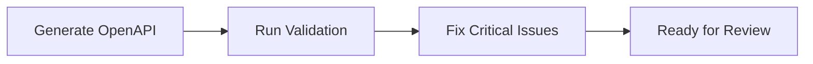

# Prism Validation Quick Start Guide

## What is Prism Validation?

Prism validation tests your OpenAPI specification by:

- Starting a mock API server based on your spec
- Testing every endpoint automatically
- Documenting what works and what doesn't
- Suggesting fixes for common issues

## Quick Start

### One Command to Rule Them All

```
/run-prism-validation VTEX - License Manager API.json
```

That's it! The command will:

1. ✅ Find your OpenAPI file
2. ✅ Start Prism mock server
3. ✅ Test all endpoints
4. ✅ Generate a detailed report
5. ✅ Clean up when done

## Command Options

### Basic Usage

```
/run-prism-validation {filename}
```

### With Auto-Fix

```
/run-prism-validation {filename} --fix
```

Automatically fixes common issues in your OpenAPI file.

### Verbose Mode

```
/run-prism-validation {filename} --verbose
```

Includes detailed logs and debugging information.

### Quick Mode

```
/run-prism-validation {filename} --quick
```

Tests only core endpoints for faster results.

### Export JSON

```
/run-prism-validation {filename} --export-json
```

Also saves results as JSON for programmatic use.

## What to Expect

### Timeline

| Phase | Duration | What Happens |
| ----- | -------- | ------------ |
| Initialization | 10-15 sec | Starts Prism, parses OpenAPI |
| Testing | 2-5 min | Tests all endpoints |
| Report Generation | 10-20 sec | Creates markdown report |
| **Total** | **3-6 min** | For typical API with 20-50 endpoints |

### Output

You'll get a comprehensive markdown report in `tests/prism/[prefix] {api-name} - {date}.md`:

```markdown
# API Name - Prism Validation Report

## Executive Summary

✅ Success Rate: 85%
⚠️ Warnings: 5
❌ Critical Issues: 2

## Detailed Results

[Complete test results for every endpoint]

## Issues Identified

[Prioritized list of problems found]

## Recommendations

[Specific actions to take]
```

## Common Scenarios

### Scenario 1: Testing a New API

**Use Case:** You just generated a new OpenAPI spec and want to validate it.

**Command:**

```
/run-prism-validation VTEX - New API.json
```

**Expected Results:**

- Most endpoints should pass (70-90%)
- Common issues: Missing examples, incomplete schemas
- **Action:** Review report, fix critical issues

---

### Scenario 2: Pre-Review Check

**Use Case:** Before manually reviewing an API, check for technical issues.

**Command:**

```
/run-prism-validation VTEX - Existing API.json --verbose
```

**Expected Results:**

- Identifies technical problems before human review
- Saves reviewer time
- **Action:** Fix technical issues first, then review content

---

### Scenario 3: Quick Health Check

**Use Case:** Rapidly check if an API spec is valid.

**Command:**

```
/run-prism-validation VTEX - API.json --quick
```

**Expected Results:**

- Fast results (30-60 seconds)
- Tests only main endpoints
- **Action:** Use for quick iteration during development

---

### Scenario 4: Production Validation

**Use Case:** Comprehensive validation before release.

**Command:**

```
/run-prism-validation VTEX - API.json --verbose --export-json
```

**Expected Results:**

- Thorough testing of all endpoints
- JSON output for CI/CD integration
- **Action:** Achieve 95%+ success rate before release

---

### Scenario 5: Auto-Fix Common Issues

**Use Case:** Automatically fix known problems.

**Command:**

```
/run-prism-validation VTEX - API.json --fix
```

**Expected Results:**

- Backs up original file
- Applies safe fixes automatically
- Re-runs validation to confirm
- **Action:** Review applied changes, commit if satisfied

## Understanding Results

### Status Codes

| Code | Meaning | Action Required |
| ---- | ------- | --------------- |
| 200 OK | ✅ Perfect | None |
| 204 No Content | ✅ Success, no body | Normal for DELETE/PUT |
| 401 Unauthorized | ⚠️ Security test | Expected, not a real issue |
| 422 Unprocessable | ⚠️ Validation issue | Review parameters/schema |
| 405 Not Allowed | ⚠️ Wrong method | Check HTTP method |
| 500 Server Error | ❌ Spec problem | Critical - fix immediately |

### Issue Severity

| Level | Symbol | Meaning | Action |
| ----- | ------ | ------- | ------ |
| Critical | ❌ | Breaks functionality | Must fix before release |
| High | ⚠️ | Causes problems | Fix soon |
| Medium | ℹ️ | Incomplete docs | Fix when possible |
| Low | 💡 | Nice to have | Optional improvement |

## Success Criteria

### Development Phase

- ✅ 60%+ success rate
- ✅ No critical issues
- ✅ All core endpoints work

### Review Phase

- ✅ 80%+ success rate
- ✅ No critical/high issues
- ✅ Examples match schemas

### Production Phase

- ✅ 95%+ success rate
- ✅ Zero critical issues
- ✅ All documented features work

## Troubleshooting

### "File not found"

- Check filename spelling
- Ensure file is in `openapi-schemas` folder
- Use exact filename including spaces

### "Port already in use"

- Previous Prism instance still running
- Command will automatically try next port
- Or manually stop process using that port

### "All tests failing"

- Check if Prism started successfully
- Verify OpenAPI file is valid JSON
- Try with `--verbose` flag for details

### "Taking too long"

- Large APIs (100+ endpoints) can take 10-15 minutes
- Use `--quick` mode for faster results
- Run in background while doing other work

## Tips & Tricks

### Tip 1: Run Before Every Commit

Create a habit of validating before committing OpenAPI changes:

```bash
/run-prism-validation {file} && git commit
```

### Tip 2: Compare Reports Over Time

Keep validation reports to track improvements:

```
tests/prism/
├── 2025-01-10-api-validation.md
├── 2025-01-15-api-validation.md  ← 85% → 90% improvement!
└── 2025-01-20-api-validation.md
```

### Tip 3: Focus on Critical Issues First

Don't try to fix everything at once:

1. Fix critical (❌) issues first
2. Then high (⚠️) issues
3. Save low (💡) issues for later

### Tip 4: Use Auto-Fix for Common Problems

Let the tool fix obvious issues:

```
/run-prism-validation {file} --fix
```

Then review what changed before committing.

### Tip 5: Validate Changed Endpoints Only

After making changes, focus validation on what changed:

1. Note which endpoints you modified
2. Check those specific sections in the report
3. Full validation can come later

## Integration with Workflows

### After Generating OpenAPI



### Before Manual Review


### Before Release


